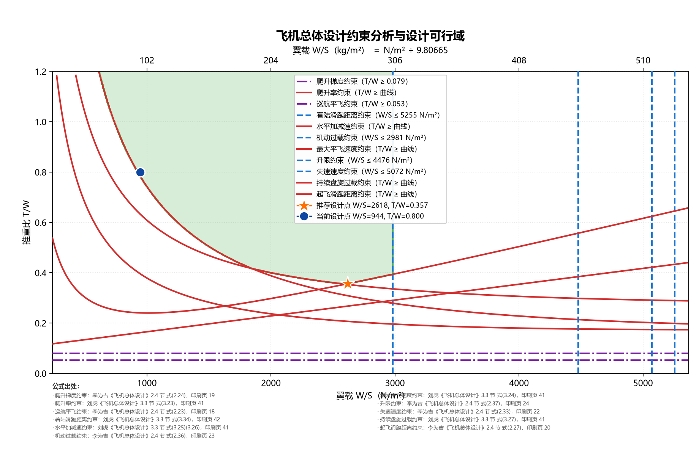

# 飞机总体设计约束分析与可行域绘图

在「**翼载 W/S — 推重比 T/W**」平面上绘制各项飞行性能约束曲线，求交集得到**设计可行域**并输出图表。



---

## 目录

- [1. 它解决什么问题](#1-它解决什么问题)
- [2. 环境要求与安装](#2-环境要求与安装)
- [3. 快速开始](#3-快速开始)
- [4. 使用说明](#4-使用说明)
  - [4.1 输入设计参数](#41-输入设计参数)
  - [4.2 运行分析](#42-运行分析)
  - [4.3 阅读终端报告](#43-阅读终端报告)
  - [4.4 调整绘图窗口](#44-调整绘图窗口)
- [5. 读懂输出图](#5-读懂输出图)
- [6. 已实现的约束](#6-已实现的约束)
- [7. 添加你自己的约束模型](#7-添加你自己的约束模型)
- [8. 项目结构](#8-项目结构)
- [9. 常见问题](#9-常见问题)
- [10. 公式溯源与参考文献](#10-公式溯源与参考文献)

---

## 1. 它解决什么问题

飞机总体设计的初始阶段，需要确定两个最关键的总体参数：

- **翼载 W/S** —— 飞机重量 ÷ 机翼参考面积
- **推重比 T/W** —— 海平面静止（零速度）、标准大气、设计起飞重量、最大油门状态下的推力 ÷ 重量

这两个参数不能随便挑。翼载太大，则起飞滑跑距离、失速速度达不到要求；推重比太小，则爬升、加速、机动性能不足；而推重比过大又意味着发动机更重、耗油更多，起飞总重随之上涨。

**约束分析**的做法是：把每一项性能要求（起飞滑跑距离、爬升梯度、最大平飞速度、失速速度……）都翻译成 W/S–T/W 平面上的一条**边界线**，线的一侧满足该要求。所有要求同时被满足的区域，就是**设计可行域**。

```text
        T/W
         ↑
         │        可行域（所有约束的交集）
         │       ╱‾‾‾‾‾‾‾‾╲
         │      ╱          ╲
         │     ╱            ╲
         │    ╱              ╲
         │   ╱                ╲
         │  ╱   ★ 推荐设计点    ╲
         └─┴────────────────────┴──────→ W/S
```

可行域内任取一点都是一组合法的总体参数；其中 **T/W 最小**的点最省推力（通常也最省油），软件的「推荐设计点」就是它。

**坐标系约定**（全项目统一）

| 轴 | 物理量 | 内部单位 | 说明 |
| --- | --- | --- | --- |
| x | 翼载 W/S | N/m² | 图中顶部同时给出 kg/m² 刻度 |
| y | 推重比 T/W | 无量纲 | |

---

## 2. 环境要求与安装

- Python ≥ 3.11（已在 Python 3.14 / Windows 上验证）
- 依赖：`numpy`、`matplotlib`、`scipy`

### Windows (PowerShell)

```powershell
python -m venv .venv
.venv\Scripts\Activate.ps1
pip install -r requirements.txt
```

### macOS / Linux

```bash
python3 -m venv .venv
source .venv/bin/activate
pip install -r requirements.txt
```

> **中文字体**：图上的中文标签需要系统装有中文字体。Windows 自带「微软雅黑」即可；
> Linux 若显示为方框，请安装 `fonts-noto-cjk` 或 `wqy-zenhei`。程序在找不到中文字体时
> 会在终端给出提示。

---

## 3. 快速开始

```powershell
python main.py
```

终端会打印全部约束及其公式出处、可行域结论，并在 `output/constraint_analysis.png` 生成图表。

---

## 4. 使用说明

### 4.1 输入设计参数

**唯一的参数入口是 `config/params.py`** 里的 `DesignParams` 数据类。改动它即可，不需要动其他任何文件。

所有参数一律使用 **SI 单位**（N、m、s、kg、rad、K）。字段自带单位与出处注释，逐一说明如下。

#### 任务与总体

| 字段 | 单位 | 含义 |
| --- | --- | --- |
| `takeoff_weight` | N | 起飞总重 W_TO |
| `wing_area` | m² | 机翼参考面积 S |
| `takeoff_thrust` | N | 海平面静止、最大油门下的安装推力 F0 |

> **这三个参数不会改变可行域，它们只决定「当前设计点」的位置。**
>
> 可行域画在 $(W/S,\;T/W)$ 平面上，这两个量本身就是独立设计变量，因此
> **可行域与总重无关**。总重 $W_{TO}$ 只通过两个比值影响你处在平面上的位置：
>
> $$\frac{W}{S} = \frac{W_{TO}}{S}, \qquad \frac{T}{W} = \frac{F_0}{W_{TO}}$$
>
> 所以：单独改 `takeoff_weight` 会同时移动设计点的横纵坐标，但**边界曲线一条都不会动**。
> 软件会把这个点画在图上（蓝点）并告诉你它是否落在可行域内、违反了哪几条约束。

#### 气动特性

| 字段 | 单位 | 含义 | 典型值 |
| --- | --- | --- | --- |
| `aspect_ratio` | — | 机翼展弦比 A | 运输机 7~10 |
| `oswald_e` | — | 奥斯瓦尔德效率因子 e | 战斗机 ≈0.6；其他 ≈0.8 |
| `cd0_clean` | — | 巡航构型零升阻力系数 C_D0 | 喷气机 ≈0.015；螺旋桨机 ≈0.020 |
| `polar_k2` | — | 极曲线一次项系数 K2 | 初步分析取 0 |
| `cl_max_takeoff` | — | 起飞构型最大升力系数 | 1.6~2.0 |
| `cl_max_landing` | — | 着陆构型最大升力系数 | 带襟翼+前缘缝翼运输机 ≈2.4 |
| `ld_takeoff` | — | 起飞滑跑状态升阻比 L/D | 亚音速 8~10；超音速 5~6 |
| `ld_cruise` | — | 巡航升阻比 L/D | 运输机 14~18 |

#### 起飞约束

| 字段 | 单位 | 含义 | 典型值 |
| --- | --- | --- | --- |
| `takeoff_ground_run` | m | 地面滑跑距离 L_TOG | 由任务要求给出 |
| `ground_friction_mu` | — | 地面摩擦因数 μ_G | 干水泥 0.02；湿水泥 0.03；硬土 0.07；草地 0.08 |

#### 爬升约束

| 字段 | 单位 | 含义 | 典型值 |
| --- | --- | --- | --- |
| `climb_gradient` | — | 爬升梯度 G（= tan γ） | 双发运输机第二阶段 ≈0.024 |

#### 速度约束

| 字段 | 单位 | 含义 |
| --- | --- | --- |
| `max_level_speed` | m/s | 最大平飞速度 v_max |
| `altitude_max_speed` | m | 最大平飞速度对应高度 |
| `cruise_speed` | m/s | 巡航速度（备查） |

#### 失速约束

| 字段 | 单位 | 含义 |
| --- | --- | --- |
| `stall_speed` | m/s | 允许的最大失速速度 V_S |
| `altitude_stall` | m | 计算高度（通常取海平面 0） |

#### 机动约束

| 字段 | 单位 | 含义 | 典型值 |
| --- | --- | --- | --- |
| `load_factor_maneuver` | — | 机动过载 n | 运输机 ≈2.5；战斗机 8~9 |
| `cl_max_maneuver` | — | 机动状态最大升力系数 | 简单后缘襟翼战斗机 0.6~0.8 |
| `maneuver_speed` | m/s | 机动速度 | 由任务要求给出 |
| `altitude_maneuver` | m | 机动高度 | 通常 3000~6000 |

#### 升限约束

| 字段 | 单位 | 含义 |
| --- | --- | --- |
| `ceiling_altitude` | m | 升限高度 H |
| `ceiling_speed` | m/s | 升限处飞行速度 v_a |
| `cl_ceiling` | — | 升限飞行时的升力系数 C_L |

#### 爬升率约束

| 字段 | 单位 | 含义 |
| --- | --- | --- |
| `climb_rate` | m/s | 要求达到的爬升率 dh/dt |
| `climb_altitude` | m | 考核高度 |
| `climb_speed` | m/s | 考核速度 V |

#### 水平加减速约束

| 字段 | 单位 | 含义 |
| --- | --- | --- |
| `acceleration_speed_initial` | m/s | 加减速起始速度 |
| `acceleration_speed_final` | m/s | 加减速终止速度 |
| `acceleration_allowable_time` | s | 允许的加减速时间 Δt |
| `acceleration_altitude` | m | 考核高度 |

#### 着陆滑跑距离约束

| 字段 | 单位 | 含义 | 典型值 |
| --- | --- | --- | --- |
| `landing_ground_run` | m | 着陆地面滑跑距离 x_LGR | 由任务要求给出 |
| `landing_friction_mu` | — | 着陆摩擦阻力系数 μ | 0.2~0.3，无数据取 0.25 |
| `touchdown_speed_factor` | — | 接地安全速度系数 k_TD | 1.25~1.30 |

#### 推力比 α 与瞬时重量比 β

`α` = 该状态安装推力 / 海平面静推力；`β` = 该状态重量 / 起飞重量。两者按**飞行工况分别设置**：

| 字段 | 工况 | 默认值 |
| --- | --- | --- |
| `alpha_max_speed` / `beta_max_speed` | 最大平飞速度 | 0.28 / 0.92 |
| `alpha_climb` / `beta_climb` | 爬升 | 0.49 / 0.96 |
| `alpha_acceleration` / `beta_acceleration` | 水平加减速 | 0.47 / 0.94 |
| `alpha_turn` / `beta_turn` | 持续盘旋 | 0.49 / 0.85 |
| `beta_landing` | 着陆 | 0.70 |

> ⚠️ **α 不是常数**：它由高度、速度、发动机类型共同决定。改动某个约束的
> `*_altitude` / `*_speed` 后**必须同步重算对应的 α**，否则该约束会被悄悄错估。
> 高涵道比涡扇可用 `core.aero.thrust_lapse_high_bypass_turbofan`（刘虎 式 3.38）计算，
> 其他发动机见式(3.39)~(3.44)。
>
> ⚠️ **单位陷阱 —— 本项目最容易出错的地方**
>
> 参考文献（李为吉《飞机总体设计》表 2.9）中的翼载以 **9.8 N/m²（即 kgf/m²）** 为单位，
> 公式中的数值系数是按该单位标定的。**本软件内部一律使用 N/m²**，两者相差约 9.8 倍。
> 抄录书上的翼载数值时必须先换算，否则可行域会整体偏移。
> 换算函数集中在 `core/units.py`（`wing_loading_kgf_to_n` / `wing_loading_n_to_kg`）。

### 4.2 运行分析

```powershell
python main.py                              # 使用默认参数，输出到 output/constraint_analysis.png
python main.py -o output/my_design.png      # 自定义输出路径
python main.py --tw-max 0.8                 # 只画 T/W ≤ 0.8 的部分
python main.py --help                       # 查看全部选项
```

命令行参数

| 参数 | 默认值 | 说明 |
| --- | --- | --- |
| `-o`, `--output` | `output/constraint_analysis.png` | 输出图片路径（目录会自动创建） |
| `--tw-max` | `1.2` | 推重比绘图窗口上限 |

**新增约束模型后不需要注册、不需要改任何配置**：程序启动时会自动扫描 `constraints/` 目录。
如果某个模型文件有语法错误或导入失败，程序会**直接报错退出**而不是静默跳过——避免出现「约束悄悄不生效、图上看不出异常」的情况。

### 4.3 阅读终端报告

运行后终端会依次输出三块信息。

#### ① 已发现的约束及其公式出处

```text
发现 7 条约束：
  - 起飞滑跑距离约束（takeoff_ground_run，curve，>=）  ← 李为吉《飞机总体设计》2.4 节 式(2.27)，印刷页 20
  ...
```

这是核对「插件是否真的生效」最快的方式——新加的模型没出现在这里，就是没被加载。

#### ② 可行域结论

```text
设计可行域非空。
  可行面积占比：33.3%（窗口 W/S 239~5366 N/m²，T/W 0.00~1.20）
  翼载 W/S 可行区间：427 ~ 2978 N/m²（43.5 ~ 303.7 kg/m²）
  推重比 T/W 可行区间：0.208 ~ 1.200
  推荐设计点（T/W 最小）：W/S = 2490 N/m²（253.9 kg/m²），T/W = 0.208
```

#### ③ 各约束的受限程度（按单独作用时的可行面积占比升序）

```text
   53.5%  机动过载约束（maneuver_load_factor, vertical, <=）
   75.2%  最大平飞速度约束（max_level_speed, curve, >=）
   ...
```

占比越小，说明这条约束「卡」得越狠，是设计的主要瓶颈。

### 4.4 调整绘图窗口

`--tw-max` 只影响**显示范围**，不影响任何约束的判定。缩小窗口不会削弱约束、也不会凭空「造出」可行域——超出窗口的约束会正确地把相应区域判为不可行。

如果 `--tw-max` 给得太小，导致所有约束都无法同时满足，可行域会变成空并给出排查提示：

```text
python main.py --tw-max 0.2
```

```text
设计可行域为空！所有约束无公共交集。

排查顺序（见 AGENTS.md 常见陷阱）：
  1. 逐条核对各约束的 sense 方向是否写反；
  2. 检查参数单位是否混用了 N/m² 与 kg/m²；
  3. 检查是否有单条约束过严（下方 feasible_fraction 最小者）。
```

---

## 5. 读懂输出图

| 图上元素 | 含义 |
| --- | --- |
| **下横轴** | 翼载 W/S，单位 **N/m²**（软件内部计算单位） |
| **上横轴** | 翼载 W/S，单位 **kg/m²**，刻度严格对应下轴的换算值 |
| **绿色填充区域** | 设计可行域——所有约束的交集 |
| **红色实线** | `curve` 型约束，T/W 随 W/S 变化（起飞滑跑距离、最大平飞速度） |
| **蓝色竖虚线** | `vertical` 型约束，纯翼载限值（失速速度、机动过载、升限） |
| **紫色横点划线** | `horizontal` 型约束，纯推重比下限（爬升梯度、巡航平飞） |
| **橙色五角星** | 推荐设计点——可行域内 T/W 最小者 |
| **蓝色圆点** | 当前设计点——由 `takeoff_weight` / `wing_area` / `takeoff_thrust` 定位；若不可行则显示为红色 |
| **底部小字** | 每条约束的公式出处（书名 + 章节 + 式号 + 页码） |

> **两个横轴为什么是 1000 对 102，而不是 1000 对 100？**
>
> 换算因子是 $g = 9.80665$，不是 10：$1000\ \mathrm{N/m^2} \div 9.80665 = 102.0\ \mathrm{kg/m^2}$。
> 如果让上下两轴各自挑选“圆整”刻度，就会出现 1000 对 100、5000 对 500 的错位，
> 既对不上线，又会误导读者按 10 倍换算（系统性偏差约 2%）。
> 因此软件**强制把上轴刻度对齐到下轴刻度的换算值上**——看到 102 而不是 100 是刻意的。

**为什么可行域是这个形状？** 两条红色曲线的作用方向相反：

- **起飞滑跑距离**：翼载越大 → 离地越难 → 需要更大推重比（**单调递增**）
- **最大平飞速度**：翼载越大意味着同重量下机翼越小 → 高速阻力越小 → 需要更小推重比（**单调递减**）

二者相交处就是整个可行域的**最低点**，也就是推荐设计点——这正是约束分析的经典结论。

---

## 6. 已实现的约束

公式取自两本《飞机总体设计》，每个模型文件的 docstring 里都保留了原始形式与单位换算说明。

| 约束 | 模型文件 | `kind` | `sense` | 出处 | 印刷页 |
| --- | --- | --- | --- | --- | --- |
| 起飞滑跑距离 | `takeoff_ground_run.py` | `curve` | `>=` | 李为吉 式(2.27) | 20 |
| 爬升梯度 | `climb_gradient.py` | `horizontal` | `>=` | 李为吉 式(2.24) | 19 |
| 巡航平飞 | `cruise_level_flight.py` | `horizontal` | `>=` | 李为吉 式(2.23) | 18 |
| 失速速度 | `stall_speed.py` | `vertical` | `<=` | 李为吉 式(2.33) | 22 |
| 机动过载（气动限制） | `maneuver_load_factor.py` | `vertical` | `<=` | 李为吉 式(2.36) | 23 |
| 升限 | `service_ceiling.py` | `vertical` | `<=` | 李为吉 式(2.37) | 24 |
| 最大平飞速度 | `max_level_speed.py` | `curve` | `>=` | 刘虎 式(3.24) | 41 |
| 爬升率 | `climb_rate.py` | `curve` | `>=` | 刘虎 式(3.23) | 41 |
| 水平加减速 | `level_acceleration.py` | `curve` | `>=` | 刘虎 式(3.25)(3.26) | 41 |
| 持续盘旋过载 | `sustained_turn.py` | `curve` | `>=` | 刘虎 式(3.27) | 41 |
| 着陆滑跑距离 | `landing_ground_run.py` | `vertical` | `<=` | 刘虎 式(3.34) | 42 |

### 两本书是什么关系？——已数值交叉验证

两书**不是相互矛盾，而是同一物理的不同写法**，本项目同时保留：

| 交叉验证结论 | 实测偏差 |
| --- | --- |
| 李为吉爬升式(2.24) 水平线 = 刘虎爬升式(3.23) 对 $C_L$ 取极小 | $7.6\times10^{-12}$ |
| 李为吉最大速度式(2.31) 合并 $C_D$ = 刘虎式(3.24) 极曲线分离式 | $3.9\times10^{-16}$ |
| 起飞滑跑距离项：李为吉系数 1.2 vs 刘虎 $k_{TO}^2/\rho$ | 2.08% |

具体地说：

- **爬升**：李为吉 $T/W \ge G + 2\sqrt{C_{D0}/(\pi A e)}$ 是刘虎爬升曲线对 $C_L$ 取极小的结果，
  给出**最保守的水平下界**；刘虎给的是**指定速度下的真实曲线**。两者分别对应“爬升梯度”
  与“爬升率”两类指标，因此 `climb_gradient` 与 `climb_rate` 同时保留。
- **最大速度**：把极曲线代入李为吉的 $T/W = \frac{1}{2}\rho V^2 C_D/(W/S)$ 就得到刘虎的式子。
  本项目采用刘虎的分离写法（显式区分 $C_{D0}$ 与诱导阻力），**曲线因此存在特征极小值**，
  而合并写法会退化成单调递减的双曲线。
- **机动**：`maneuver_load_factor`（李为吉）管“机翼够不够大”（升力限制），
  `sustained_turn`（刘虎）管“发动机够不够强”（推力限制），**两者互补，必须同时满足**。

### 统一的主管方程

刘虎把全部约束统一成一个从能量方程推出的**主管方程**（式 3.15），代码实现在
`core.aero.required_thrust_weight`：

```text
F0/(m0 g) = (β/α) · { K1·n²·CL + K2·n + CD0/CL + dh/dt / V + (dV/dt)/g }
CL = n·β·(W/S)/q
```

每条约束只是它的一个特例：最大平飞速度 ``n=1, ḣ=0, V̇=0``；爬升率 ``n=1, ḣ=ROC``；
水平加减速 ``n=1, V̇≠0``；持续盘旋 ``n>1``。**新增曲线型约束请优先调用这个函数**，
这样物理假设会显式出现在调用处，可审查、可比对。

**方向判据**：书中的选取规则是「推重比取各准则所得值的**最大值**，翼载取各准则所得值的**最小值**」。
因此 **所有 T/W 类约束的 `sense` 都是 `>=`，所有 W/S 类约束的 `sense` 都是 `<=`**。
拿不准方向时用这条反查——方向写反会让可行域完全错误，而图表看起来依然「正常」，极难发现。

---

## 7. 添加你自己的约束模型

这是本软件的核心设计：**新增一个约束 = 往 `constraints/` 目录放一个文件，不需要改动任何其他代码。**

每个模型文件必须做三件事：

1. 定义一个签名固定的函数 `(params, ws) -> np.ndarray | float`
2. 用 `@register_constraint(ConstraintMeta(...))` 装饰它，声明元数据
3. 在 `requires` 里列出全部依赖的参数名（供启动时做缺参预检）

`kind` 三种取值决定了约束在平面上的形态：

| `kind` | 含义 | 返回值 |
| --- | --- | --- |
| `curve` | y = f(x)，T/W 随 W/S 变化 | 与 `ws` 同形状的数组 |
| `vertical` | x = const，纯翼载限值 | 标量（W/S 限值，N/m²） |
| `horizontal` | y = const，纯推重比下限 | 标量（T/W 限值） |

### 完整示例：加入「航程最优翼载」约束

取李为吉 2.4 节 式(2.41)——喷气飞机为达到最大航程而选择的翼载：

```python
# constraints/range_wing_loading.py
"""航程最优翼载约束。

公式出处：李为吉《飞机总体设计》第 2 章 2.4 节，式(2.41)，印刷页 24。
原式：W/S = ½ ρ v² √(π A e C_D0 / 3)
"""

from __future__ import annotations

import numpy as np

from core.units import isa_density

from .base import ConstraintKind, ConstraintMeta, register_constraint


@register_constraint(
    ConstraintMeta(
        key="range_wing_loading",
        name_cn="航程最优翼载约束",
        category="巡航",
        sense="<=",                              # 翼载不得超过此值
        kind=ConstraintKind.VERTICAL,            # 与 T/W 无关 → 竖直线
        requires=(
            "cruise_speed",
            "cruise_altitude",
            "cd0_clean",
            "aspect_ratio",
            "oswald_e",
        ),
        reference="李为吉《飞机总体设计》2.4 节 式(2.41)，印刷页 24",
    )
)
def compute(params, ws: np.ndarray) -> float:
    """返回为达到最大航程所允许的最大翼载。"""
    density = float(isa_density(params.cruise_altitude))
    factor = np.sqrt(
        np.pi * params.aspect_ratio * params.oswald_e * params.cd0_clean / 3.0
    )
    return float(0.5 * density * params.cruise_speed**2 * factor)
```

随后在 `config/params.py` 的 `DesignParams` 里补上 `cruise_altitude: float = 11_000.0`（巡航高度，m），
运行 `python main.py`，新约束就会自动出现在终端列表、图例和可行域求交中。

### 曲线型约束：请用统一的主管方程

若新约束的 T/W 随翼载变化（`kind=curve`），**不要自己另起炉灶推导**，直接调用
`core.aero.required_thrust_weight`（刘虎主管方程 式 3.15）。这样过载、爬升率、加速度
等物理假设会**显式出现在调用处**，可审查、可比对：

```python
# constraints/supersonic_cruise.py
"""超声速巡航约束。

公式出处：刘虎《飞机总体设计》3.3 节 式(3.24)，印刷页 41
（主管方程取 n=1, ḣ=0, V̇=0, R=0）。
"""

from __future__ import annotations

import numpy as np

from core.aero import induced_drag_factor, required_thrust_weight
from core.units import dynamic_pressure, isa_density

from .base import ConstraintKind, ConstraintMeta, register_constraint


@register_constraint(
    ConstraintMeta(
        key="supersonic_cruise",
        name_cn="超声速巡航约束",
        category="巡航",
        sense=">=",
        kind=ConstraintKind.CURVE,
        requires=(
            "cruise_speed", "cruise_altitude", "cd0_clean", "aspect_ratio",
            "oswald_e", "polar_k2", "beta_max_speed", "alpha_max_speed",
        ),
        reference="刘虎《飞机总体设计》3.3 节 式(3.24)，印刷页 41",
    )
)
def compute(params, ws: np.ndarray) -> np.ndarray:
    """给定翼载，返回超声速巡航所需的推重比下限。"""
    density = float(isa_density(params.cruise_altitude))
    q = float(dynamic_pressure(density, params.cruise_speed))
    k1 = float(induced_drag_factor(params.aspect_ratio, params.oswald_e))

    return np.asarray(
        required_thrust_weight(
            wing_loading=ws,
            dynamic_pressure=q,
            cd0=params.cd0_clean,
            k1=k1,
            k2=params.polar_k2,
            load_factor=1.0,
            beta=params.beta_max_speed,
            alpha=params.alpha_max_speed,
        )
    )
```

### 编写要点

- **全 numpy 向量化**：`ws` 是数组，返回值形状必须一致，不要用 Python 循环逐点算
- **除零保护**：`ws → 0` 时公式常发散，用 `core.numeric.ignore_divide_warnings()` 抑制告警；
  清理 `inf`/`nan` 由分析层统一负责，模型里不要自己截断
- **不写死工况**：高度、温度、速度一律取自 `params`，否则无法做多工况对比
- **不做单位换算**：换算函数集中在 `core/units.py`，模型里只做物理计算
- **公式必须可溯源**：`reference` 字段为必填，禁止凭记忆写公式

> 更完整的流程（含公式溯源、验证清单）见 `.github/skills/add-constraint-model/SKILL.md`，
> 在 VS Code 中可直接输入 `/add-constraint-model` 调用；
> 骨架模板见 `.github/skills/add-constraint-model/assets/constraint_model_template.py`。

---

## 8. 项目结构

```text
main.py                          唯一入口：读参数 → 发现约束 → 求交 → 出图
config/params.py                 用户输入的总设参数（唯一数据源，带单位注释）
constraints/                     约束曲线模型库 —— 面向使用者的插件目录
  base.py                        接口契约：ConstraintMeta / register_constraint
  registry.py                    注册表 + 目录自动发现
  <约束名>.py                    每个约束一个文件，文件名 = key 的 snake_case
core/                            与具体约束无关的算法（纯计算，不做 I/O）
  units.py                       单位换算 + 国际标准大气 ISA
  aero.py                        极曲线 + 约束分析主管方程（刘虎 式 3.15）
  numeric.py                     数值保护：清理 inf/nan
  validator.py                   缺参预检
  analyzer.py                    求交、可行域提取、诊断报告
plotting/plot_region.py          只负责绘图，不参与任何计算
tools/render_reference_pages.py  把扫描版参考书渲染成 PNG（供查阅公式）
docs/images/                     README 用图
output/                          生成的图表（不入库）
参考文献/                         参考书 PDF（不入库，见下节）
```

---

## 9. 常见问题

### 图上的中文变成了方框

系统缺少中文字体。Windows 一般自带「微软雅黑」；Linux 请安装 `fonts-noto-cjk`，
并清掉 matplotlib 的字体缓存（`~/.cache/matplotlib`）。

### 改了起飞重量，图怎么没变化？

**这是正常的，不是 bug。** 约束分析在 $(W/S,\;T/W)$ 平面上进行，这两个量本身就是
设计变量，因此可行域**与总重无关**——重一倍的飞机配上大一倍的机翼，起飞距离、
爬升、失速速度全都一样。

总重只影响「当前设计点」的位置：$W/S = W_{TO}/S$、$T/W = F_0/W_{TO}$。
你应该看到的是**蓝点在图上移动**，而不是曲线移动。若蓝点跑到可行域外，
终端会告诉你它违反了哪几条约束。

终端还会把推荐设计点折算成具体指标，帮你把平面上的结论变成可执行的方案：

```text
  推荐设计点（T/W 最小）：W/S = 2618 N/m²，T/W = 0.357
      折算到起飞重量 → 机翼面积 S = 95.5 m²，需海平面静推力 F0 = 89,149 N
```

### 设计可行域为空

按终端给出的顺序排查，不要急着「调参数」：

1. 先查 `sense` 方向——这是最高频的错误，且图上完全看不出来
2. 再查单位——是否把 kgf/m² 的数值直接填进了 N/m² 的字段（差约 9.8 倍）
3. 最后看终端列出的「受限程度」，找出占比最小、也就是卡得最狠的那条约束

### 我加的新约束没生效

- 检查是否漏了 `@register_constraint(...)` 装饰器（最常见原因）
- 检查程序启动时打印的「发现 N 条约束」列表里有没有它
- 检查 `requires` 里的参数名是否都在 `config/params.py` 中定义——缺参会在启动时直接报错

### 报错说某约束返回形状与输入不一致

`curve` 型约束必须返回与 `ws` 同形状的数组。写成 `return 3.5`（标量）会被判为形状错误；
若要表达纯推重比下限，请改用 `kind=ConstraintKind.HORIZONTAL`。

---

## 10. 公式溯源与参考文献

本软件所有数学模型**均可溯源**，不包含任何凭记忆写下的公式。每个约束模型的 `reference`
字段与 docstring 都标注了书名、章节、式号与页码，图底部也会列出全部出处。

- 李为吉 主编《飞机总体设计》—— 第 2 章 **2.4 节「确定推重比和翼载」**（印刷页 17–25）是本项目的核心依据
- 刘虎 等《飞机总体设计》

> **`参考文献/` 目录不入库**
>
> 两本参考书均为受版权保护的出版物，本仓库**不包含也不分发**其 PDF（已写入 `.gitignore`）。
> 软件运行本身**不依赖**这些 PDF —— 全部公式已经实现并标注出处。
> 只有当你需要用 `tools/render_reference_pages.py` 回查原文时，才需要自行准备纸质书或电子版，
> 并把 PDF 放入 `参考文献/` 目录：
>
> ```powershell
> pip install pymupdf                    # 仅该工具需要，不在项目运行依赖里
> python tools\render_reference_pages.py 0 30 38 --dpi 160
> #   0 = 李为吉（印刷页 = PDF 页 − 13），1 = 刘虎
> #   输出到 output/reference_pages/book<N>/
> ```

---

## 许可

仅供教学与科研使用。参考书版权归原作者与出版方所有。
